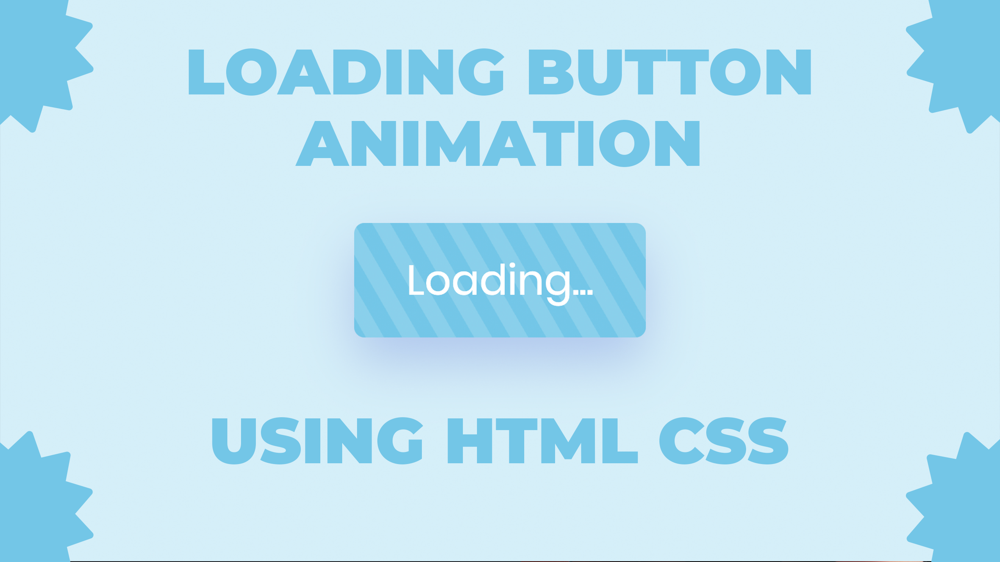

# Loading Button Animation Effects Using HTML & CSS

Loading button animation effects created using HTML and CSS are a visually engaging way to indicate to users that a process is ongoing or that content is being fetched. These animations are designed to provide visual feedback, reassuring users that their action has been registered and that the system is actively processing their request. By leveraging keyframe animations and CSS properties such as @keyframes and transform, developers can simulate movement within the button, creating the impression of a loading indicator. This effect is commonly used in web applications and websites that involve data retrieval or processing tasks. By incorporating loading button animation effects, developers can enhance the user experience, making it more intuitive and interactive, while also adding an element of visual appeal to the interface. These animations contribute to a smoother and more engaging browsing experience, improving overall user satisfaction and perception of the website or application.

